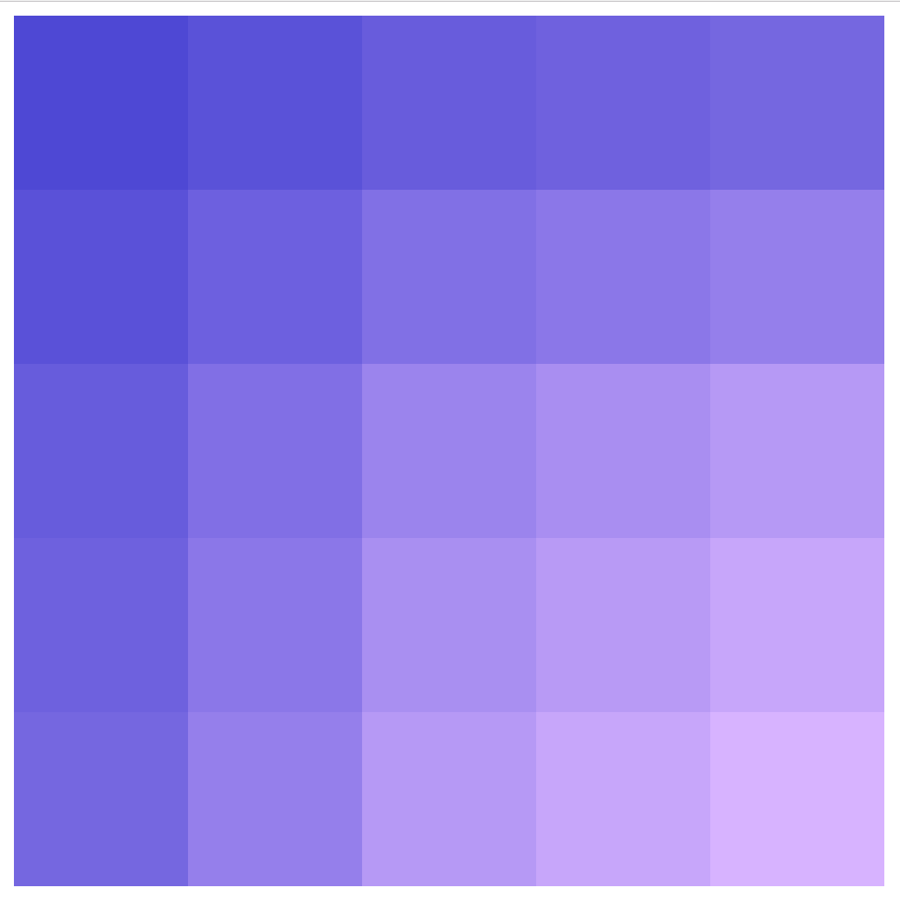
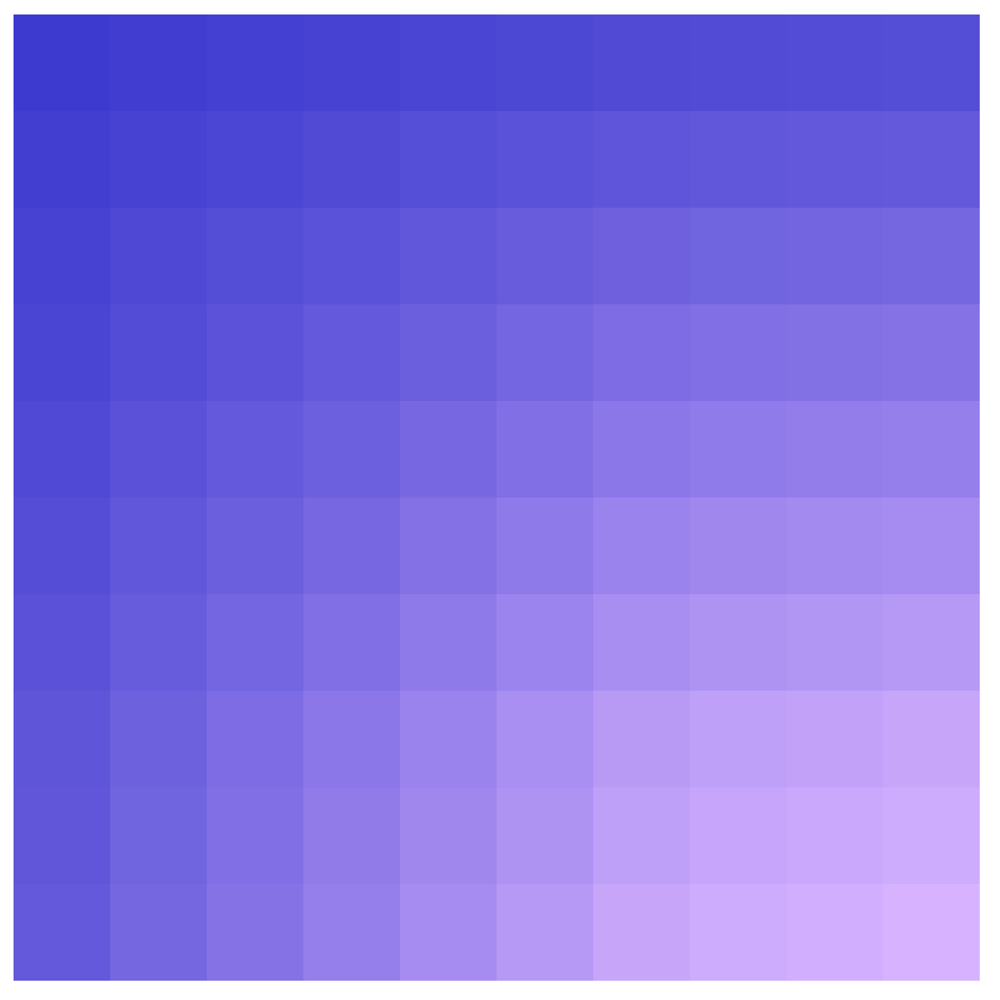

# Gradient-Grid
Generating custom gradient grids using pure CSS.  Base code from http://enjoycss.com/gallery/gradient_patterns/hA.  The first version I created adjusted some of the gradients and used variables for the colors.  There is also a lot of commentary that I added while picking apart the code to see how it works.  The second version is a 10x10 gradient grid, as opposed to the original 5x5.

5x5

10x10

